# Sentinel-2 Land-Cover Classification with Traditional Machine Learning and Deep Learning

## Table of Contents
- [Project Overview](#project-overview)
- [Code Tutorial and Walkthrough](#code-tutorial-and-walkthrough)
- [Background and Motivation](#background-and-motivation)
- [Problem Statement](#problem-statement)
- [Data Provenance](#data-provenance)
- [Methodology](#methodology)
  - [Experiment Design](#experiment-design)
  - [Classification Methods](#classification-methods)
  - [Environmental Cost Evaluation](#environmental-cost-evaluation)
- [Results and Performance](#results-and-performance)
- [Environmental Impact Assessment](#environmental-impact-assessment)
- [Discussion](#discussion)
- [Limitations and Future Work](#limitations-and-future-work)
- [Reproducibility and Execution](#reproducibility-and-execution)
- [Repository Structure](#repository-structure)
- [References](#references)

## Project Overview

This project addresses a core AI4EO classification task: land-cover recognition from Sentinel-2 image patches. In contrast to the first project, which focused on Arctic freeboard interpolation and reconstruction, this repository studies a supervised image-classification problem and evaluates whether optimized pretrained deep models provide meaningful gains over a lightweight traditional baseline under practical local-compute constraints.

The final delivery follows the same research-style structure as `GEOL0069-Project`: documented repository layout, executed notebook, generated figures and tables, bilingual presentation materials, and an explicit environmental cost assessment.

The main benchmark is the RGB version of the EuroSAT dataset, a labeled Sentinel-2 land-use/land-cover dataset. To keep the experiments reproducible and local-machine friendly, the final analysis uses a balanced subset of 600 images per class across 10 classes, for a total of 6000 samples.

## Code Tutorial and Walkthrough

For a concise external walkthrough of this final project implementation, watch the presentation demo below:

[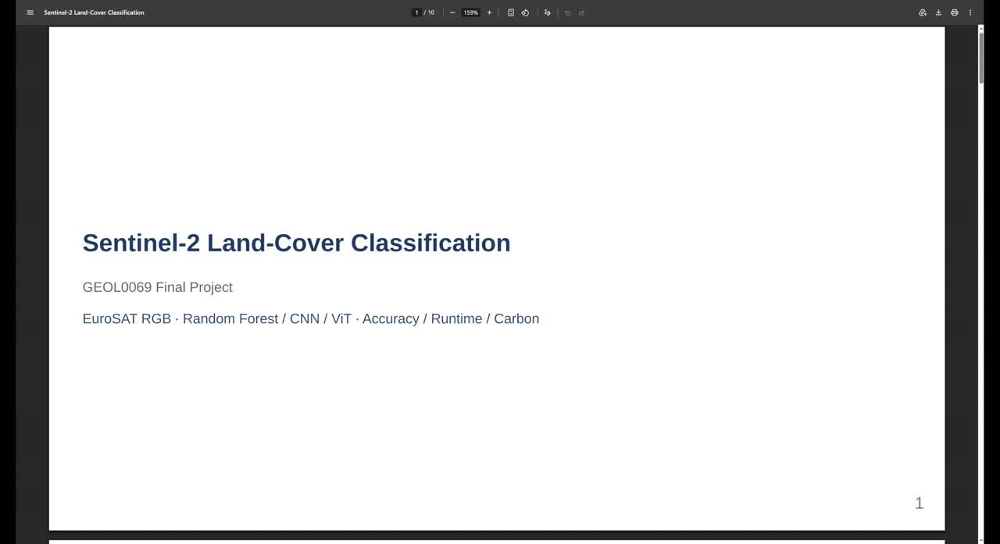](assets/videos/final_project_method_walkthrough.mp4)

[Direct video link](assets/videos/final_project_method_walkthrough.mp4)

The video highlights the end-to-end workflow: reproducible data setup, RF/CNN/ViT comparison strategy, updated evaluation outcomes, and practical performance-cost trade-offs for AI4EO deployment decisions.

## Background and Motivation

Land-cover classification is a foundational Earth-observation task with applications in agriculture, environmental monitoring, infrastructure mapping, and urban planning. Sentinel-2 imagery is especially suitable for this problem because it offers consistent optical observations at spatial scales that support patch-based scene classification.

From an engineering perspective, land-cover classification is also a good setting for comparing model families. Traditional machine-learning methods are often fast and inexpensive, while deep-learning methods may produce much better accuracy but at higher computational cost. This trade-off is highly relevant for AI4EO workflows intended to run on local hardware or limited shared compute.

## Problem Statement

This project is designed to answer four questions:

1. How do traditional machine-learning and deep-learning methods compare on Sentinel-2 land-cover classification?
2. Can a pretrained CNN significantly outperform a Random Forest baseline on a balanced EuroSAT subset?
3. Can a pretrained ViT further improve classification quality beyond the CNN?
4. What is the accuracy-runtime-carbon trade-off for the tested methods under local execution?

## Data Provenance

### Source dataset

- `EuroSAT_RGB`
  - source: Zenodo release of the EuroSAT benchmark
  - content: labeled RGB Sentinel-2 image patches across 10 land-cover classes
  - archive retained in the repository at `data/raw/EuroSAT_RGB.zip`

### Classes used in the final experiment

- AnnualCrop
- Forest
- HerbaceousVegetation
- Highway
- Industrial
- Pasture
- PermanentCrop
- Residential
- River
- SeaLake

### Final analysis subset

- balanced subset size: `600` images per class
- total samples: `6000`
- split:
  - train: `4200`
  - validation: `900`
  - test: `900`

The final split summary is exported to `outputs/tables/split_summary.csv`.

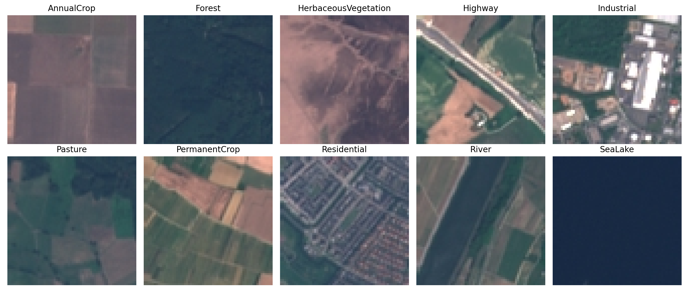
*Figure 2. One representative RGB patch from each EuroSAT class used in the balanced subset.*

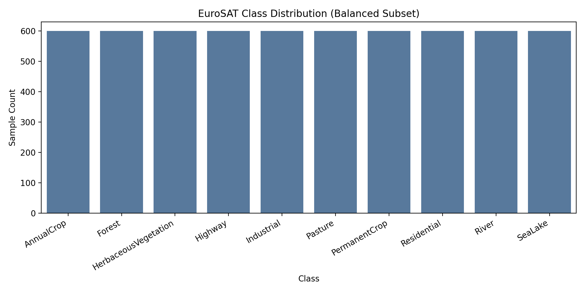
*Figure 3. Final balanced class distribution used in the experiments.*

## Methodology

The analysis workflow implemented in `notebooks/final_project.executed.ipynb` is:

1. Download and extract the EuroSAT RGB archive.
2. Build a balanced subset with fixed random seed control.
3. Create train/validation/test splits with stratification.
4. Train and evaluate a Random Forest baseline.
5. Fine-tune a pretrained CNN classifier.
6. Fine-tune a pretrained ViT classifier.
7. Aggregate performance, runtime, and carbon estimates.
8. Export all final figures and tables for presentation and reporting.

### Experiment Design

The final design intentionally favors reproducibility and local feasibility:

- balanced subset rather than the full archive,
- fixed split ratios across methods,
- consistent evaluation metrics,
- explicit runtime and environmental accounting,
- one traditional baseline, one pretrained CNN, and one pretrained ViT under the same reporting protocol.

### Classification Methods

#### Random Forest baseline

- input: RGB images resized to `32x32` for feature extraction
- features:
  - per-channel color histograms,
  - per-channel summary statistics,
  - coarse quadrant-based spatial averages
- model: `RandomForestClassifier` selected by lightweight validation tuning (best setting: `n_estimators=700`, `max_features=0.3`, `min_samples_leaf=2`)
- role: low-cost traditional baseline with EO-oriented hand-crafted color and spatial descriptors

#### CNN

- backbone: pretrained `ResNet18`
- input: RGB images resized to `224x224`
- fine-tuning strategy: freeze most layers, unfreeze `layer4` and the classification head
- training epochs: `10`
- batch size: `32`
- optimizer: `AdamW` with cosine learning-rate schedule
- role: high-performance convolutional classifier

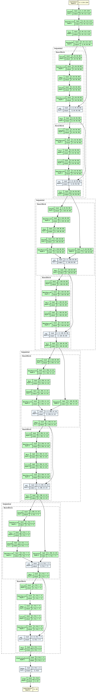
*Figure 4. Network-structure diagram of the CNN branch generated from the actual pretrained ResNet18 fine-tuning model via `torchview`.*

#### ViT

- backbone: pretrained `ViT-B/16`
- input: RGB images resized to `224x224`
- fine-tuning strategy: unfreeze the last transformer blocks and the classification head
- training epochs: `12`
- batch size: `8`
- optimizer: `AdamW` with cosine learning-rate schedule
- role: transformer-based high-accuracy comparison model

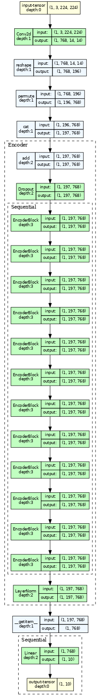
*Figure 5. Network-structure diagram of the ViT branch generated from the actual pretrained ViT-B/16 fine-tuning model via `torchview`.*

### GPU Compatibility

The local environment originally used `torch 2.4.1 + cu121`, which was incompatible with the machine's NVIDIA driver and prevented GPU execution. The setup was corrected by switching to `torch 1.13.1+cu116` and `torchvision 0.14.1+cu116`, matching the local `CUDA 11.6` driver environment. Graphviz and `torchview` were then added so that the repository could generate real architecture diagrams from the actual models. After this fix, both `CNN` and `ViT` ran successfully on `cuda`.

### Environmental Cost Evaluation

Runtime is translated into estimated carbon emissions using explicit assumptions:

- average power: `90W`
- PUE: `1.2`
- carbon intensity: `475 gCO2/kWh`

These assumptions are consistent across methods so that the comparison reflects relative cost rather than hardware-specific measurement noise.

## Results and Performance

### Headline outcomes

From `outputs/metrics/summary_metrics.json`:

- total analyzed samples: `6000`
- best accuracy: `0.9733`
- best method: `ViT`
- total estimated carbon across tested methods: `0.024112 kgCO2e`

### Method comparison

| Method | Accuracy | Macro F1 | Runtime (s) | Carbon (kgCO2e) | Device |
|---|---:|---:|---:|---:|---|
| RandomForest | 0.7611 | 0.7556 | 5.0622 | 0.0000721 | cpu |
| CNN | 0.9611 | 0.9610 | 549.2473 | 0.0078268 | cuda |
| ViT | 0.9733 | 0.9733 | 1137.7905 | 0.0162135 | cuda |

Interpretation:

- the improved Random Forest baseline is substantially stronger than the original raw-pixel version and reaches `0.7611` accuracy,
- the CNN still outperforms the Random Forest baseline by about `20.00` percentage points in absolute accuracy,
- the ViT further improves on the CNN and becomes the best-performing method in the repository,
- the Random Forest remains dramatically cheaper in runtime and carbon cost,
- this creates a clear EO-relevant trade-off between performance and compute burden.

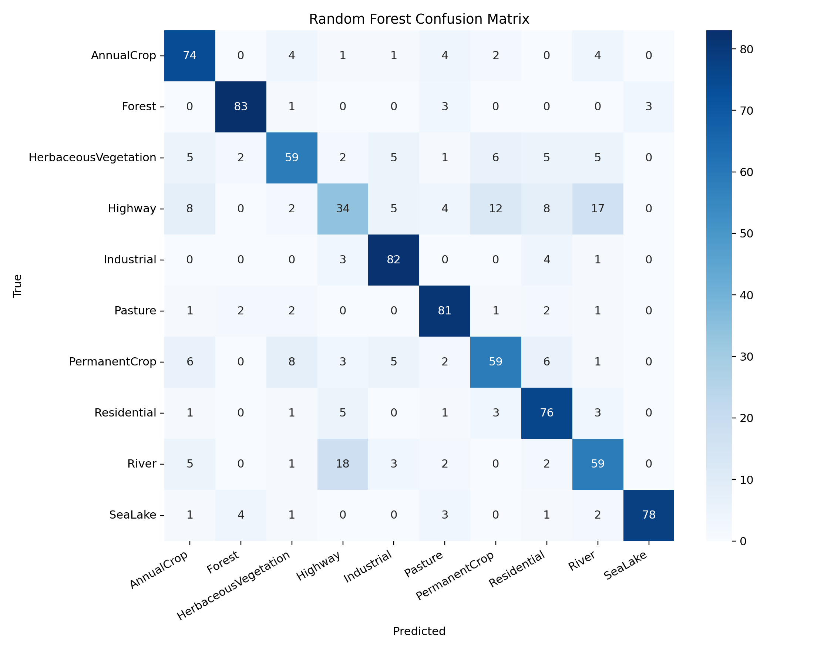
*Figure 6. Confusion matrix for the Random Forest baseline.*

*Figure 7. Confusion matrix for the CNN classifier.*

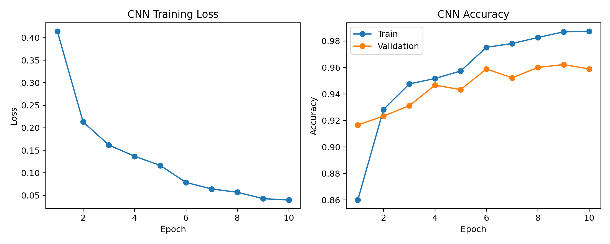
*Figure 8. CNN training loss and train/validation accuracy across epochs.*

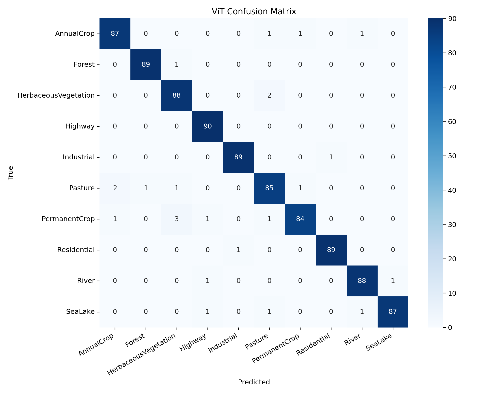
*Figure 9. Confusion matrix for the ViT classifier.*

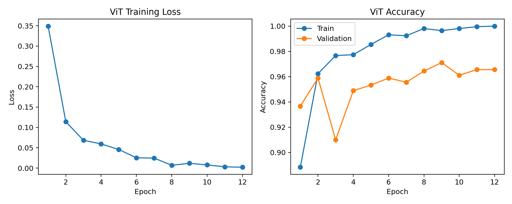
*Figure 10. ViT training loss and train/validation accuracy across epochs.*

### Qualitative prediction evidence

To complement scalar metrics and confusion matrices, the repository also exports representative prediction panels for each model. These examples are useful because they connect numerical differences back to real Sentinel-2 image content and make it easier to see where each model succeeds or fails.

*Figure 11. Representative Random Forest predictions on the test set.*

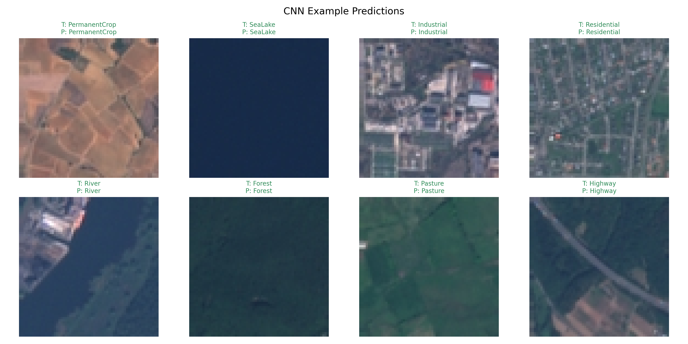
*Figure 12. Representative CNN predictions on the test set.*

*Figure 13. Representative ViT predictions on the test set.*

## Environmental Impact Assessment

The cost comparison shows a strong separation between the three approaches:

- Random Forest completed in only a few seconds with very low estimated emissions.
- CNN achieved high accuracy but required substantially longer GPU training time.
- ViT achieved the best accuracy overall.
- ViT also became the most expensive method in the final full rerun.
- Both deep models were far more expensive than the Random Forest baseline in runtime and carbon cost.

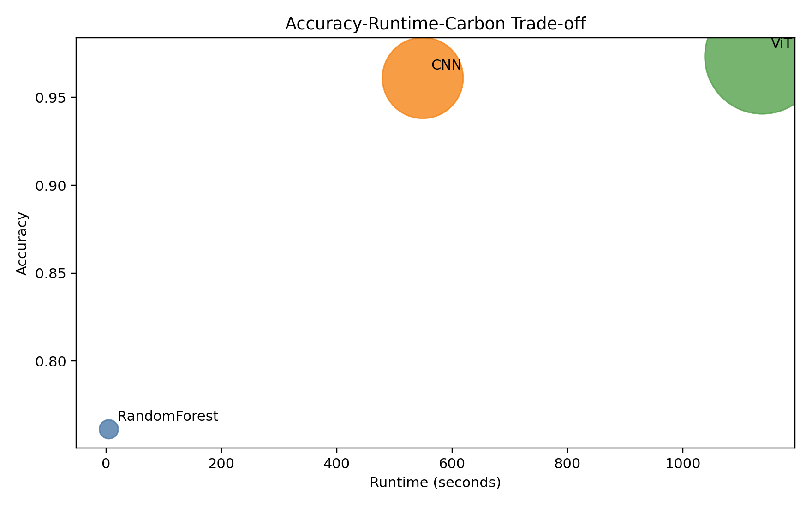
*Figure 14. Accuracy-runtime-carbon trade-off for the tested land-cover classifiers.*

This result is useful for AI4EO practice because it highlights that much better classification performance is achievable locally, but the gain is coupled to a measurable computational and environmental cost.

## Discussion

Five main conclusions emerge from the final experiment:

1. Fine-tuning pretrained deep models dramatically improves EuroSAT RGB classification quality.
2. The pretrained ViT achieves the highest overall performance in the final experiment.
3. The pretrained CNN also performs strongly and remains a powerful convolutional benchmark.
4. The improved Random Forest baseline remains useful as a very low-cost reference and becomes much more competitive after feature engineering, although it is still below the optimized deep-learning models in accuracy.
5. Better EO classification performance is still coupled to a larger runtime and carbon footprint.

The confusion matrices also show that the optimized deep models greatly reduce class confusion relative to the traditional baseline. This supports the value of transfer learning for EO classification, even on a relatively small balanced subset.

## Limitations and Future Work

Current limitations:

- the analysis still uses the RGB version of EuroSAT rather than the full multispectral archive,
- the final models are optimized for strong performance on a balanced subset rather than exhaustive hyperparameter search on the full benchmark,
- carbon estimates are assumption-based rather than direct hardware power measurements.

Natural next steps:

1. Extend the analysis to multispectral EuroSAT inputs.
2. Compare RGB-only and multispectral performance explicitly.
3. Scale to the full EuroSAT archive or broader Sentinel-2 patch datasets.
4. Add explainability analysis for class confusion and feature attribution.

## Reproducibility and Execution

Environment files:

- `requirements.txt`
- `environment.yml`

Executed notebook:

- `notebooks/final_project.executed.ipynb`

Run order:

1. Create the environment from `requirements.txt` or `environment.yml`.
2. Download/extract EuroSAT RGB if not already present.
3. Open `notebooks/final_project.executed.ipynb` for the executed narrative version or rerun it to regenerate outputs.

## Repository Structure

- `data/raw/` - raw EuroSAT archive and extracted class folders
- `data/processed/` - train/validation/test manifests
- `data/metadata/` - class mapping metadata
- `notebooks/` - final executed notebook
- `outputs/figures/` - all generated figures
- `outputs/tables/` - data and experiment summary tables
- `outputs/metrics/` - detailed reports and summary JSON

## References

1. Helber, P., Bischke, B., Dengel, A., & Borth, D. (2019). EuroSAT: A novel dataset and deep learning benchmark for land use and land cover classification. *IEEE Journal of Selected Topics in Applied Earth Observations and Remote Sensing*.
2. Sentinel-2 mission documentation, European Space Agency / Copernicus Programme.
3. Breiman, L. (2001). Random forests. *Machine Learning*.
4. Dosovitskiy, A., et al. (2021). An image is worth 16x16 words: Transformers for image recognition at scale. *ICLR*.
5. He, K., Zhang, X., Ren, S., & Sun, J. (2016). Deep residual learning for image recognition. *CVPR*.
